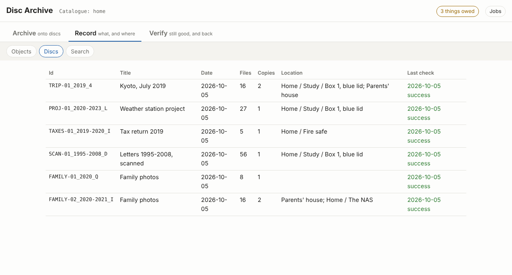
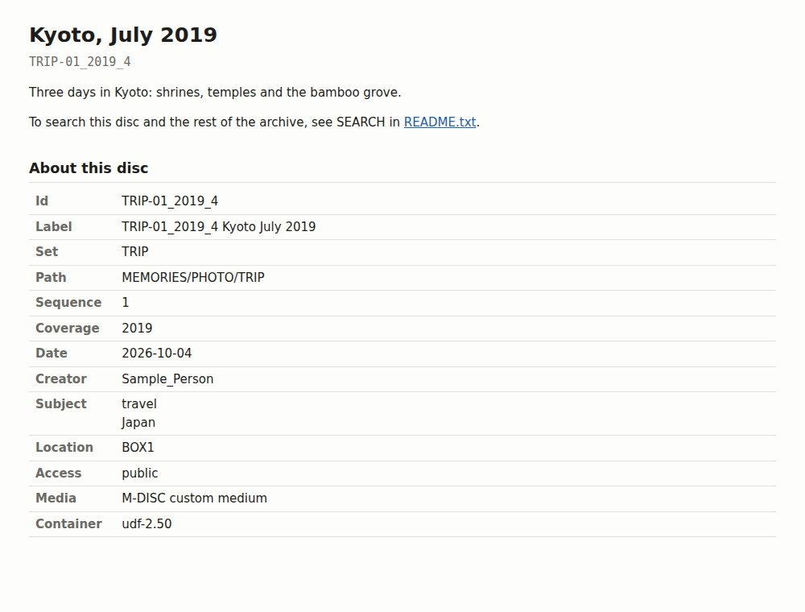

# ARV: Archive, Record, Verify

> [!WARNING]
> **Experimental. Do not trust your only copy of anything to this yet.**
> No disc made with it has been burned and read back over years; the disc format is a draft
> (0.5) and may still change in ways older discs do not follow. Keep your data where it is
> now, and treat discs made with this as an extra copy while you test it.
>
> **Written largely by an AI coding assistant** ("vibe-coded"), with a human choosing the
> direction and reviewing the results. It has tests, but it has not had the scrutiny of a
> mature project: read the code before relying on it, check what it produces, and expect
> bugs. Provided as is, with no warranty (see [LICENSE](LICENSE)).

**ARV** (`arv`; also Norwegian for "inheritance") is for **long-term archiving, not backup**.

| | A backup | An archive |
|---|---|---|
| Holds | everything, as it is now | what is worth keeping, chosen |
| For | getting back what you lost last week | your grandchildren, decades from now |
| Lives | as long as the current copy; replaced by the next one | longer than the software and the person who made it |
| Kept | online: always connected, so one mistake, failure or ransomware reaches it | **cold** where possible: offline media on a shelf, untouched until needed, copies in other places |
| Read with | the backup program that wrote it | anything: plain files, open formats, the steps on the disc itself |
| Knows | file contents | what each thing is, where every copy is, when it was last checked, why it matters |

Keep your backups (the NAS, restic, Borg, the cloud): arv sits on top of them, for the photos,
video, documents and source code that should outlive them, and puts them in cold storage
(write-once discs today) whenever it can. It is a personal archivist's tool,
and keeps the whole archive's record:

- **What you keep, over time.** A folder you sort and grow becomes a *collection* with its own
  history, like git's but for any files: each state is a revision, and each set of discs made
  from it is an edition. Each disc holds a selection of the collection and a copy of the
  catalogue, so the discs together hold what you archived, and any one of them can tell you
  about the whole archive.
- **What is archived, and where.** Point it at any folder and it says which files are already
  on which discs and which are on none, and what changed since the last edition.
- **Where every copy is, and whether it still reads.** Locations down to the box, copies per
  place, when each disc was last checked, what is overdue, what is kept in one place only.
- **Why it matters.** Appraisals (how important, to whom, why) and a log of every change,
  people's and machines' told apart.

What it writes are self-describing archive discs: your files untouched, a hash of every file,
a catalogue of the whole archive so far, the source of the tools that made it, and the steps to
check and repair it, with error correction filling the rest of the disc. All in open,
well-documented formats that can be read decades from now without this tool. Blu-ray (M-DISC
BD-R) is today's medium; the format does not depend on it.

Why it works the way it does (curated discs on top of everyday storage, plain files, copies): [docs/philosophy.md](docs/philosophy.md). The model behind the commands — collections, archives, copies, and how objects and folders relate: [docs/concepts.md](docs/concepts.md).

**Start with [docs/workflow.md](docs/workflow.md)**: the whole flow, from a folder to discs on a
shelf, finding and checking them over the years, and recovering from damage or loss.
[docs/burning.md](docs/burning.md) is how to burn and check a disc (and the drill for a new drive or
media); [docs/shelving.md](docs/shelving.md) covers arranging, labelling and storing the physical discs.
How a disc is built, in one picture: [docs/architecture.md](docs/architecture.md).

## Disc layout

```
<disc root>                  filesystem: UDF 2.50 (BD-ROM layout, metadata partition with a real mirror)
├── bagit.txt                BagIt signature (RFC 8493)
├── bag-info.txt             Bagging-Date, Bag-Group-Identifier, Bag-Count "n of N", Payload-Oxum
├── manifest-sha256.txt      per-file checksums (`sha256sum -c` compatible)
├── manifest-sha512.txt
├── tagmanifest-sha256.txt   checksums of the files above + catalog.rec
├── catalog.rec              GNU recutils catalogue for this disc
├── catalog/                 snapshot of the whole archive catalogue at burn time
│                            (archive.rec, volumes/<disc-id>/: manifest, listing, formats, tags)
├── index.html               offline viewer (no JavaScript)
├── README.txt               plain-text recovery instructions
│   data/ro-crate-metadata.json  optional RO-Crate description (--ro-crate)
├── tools/                   this tool (snapshot of the last commit, with its specs) and arv.com: the
│                            reader ready to run on Linux, macOS, Windows and BSD (x86-64, ARM64)
└── data/                    the payload
[ dvdisaster RS03 ECC data appended after the filesystem ]
```

Each layer does its own job:

| Layer | Purpose | Tool |
|---|---|---|
| dvdisaster RS03 (augmented image, [format](docs/spec/rs03-format.md)) | **Repair** unreadable sectors | `arv check --repair`, or any `dvdisaster` |
| BagIt manifests | **Detect** corruption per file, portable off-disc | `arv verify`, any BagIt tool, or plain `sha256sum -c` |
| recfile catalogue | **Find** which disc holds what, without mounting | `recsel`, `recfix` |

## What's here

| Path | What |
|---|---|
| `src/arv/` | **arv**, a C program (C99 and POSIX, no libraries): every command, from making a disc to restoring one: [src/arv/README.md](src/arv/README.md) |
| `src/udfwrite/` | arv's UDF 2.50 writer (library, built into arv, and a program): [docs/spec/archival-udf.md](docs/spec/archival-udf.md) |
| `src/rs03/` | dvdisaster's RS03 error correction: add, test, repair (library, built into arv, and a program): [docs/spec/rs03-format.md](docs/spec/rs03-format.md) |
| `src/bagit/` | BagIt (RFC 8493) checking and the digests (library, built into arv, and a `bagit` program for any bag) |
| `src/arv-assist/` | **arv-assist**, optional, in C: the local AI helpers (`arv describe`, `arv tag`, `arv models`), against local models only |
| `src/arv-gui/` | **arv-gui**, optional, in Python (standard library only): `arv gui`, the interface in your web browser; it runs arv for every action |
| `arv` | runs `src/arv/build/arv` in a checkout (and `tools/arv/arv` on a disc), building it with `make` first if needed |
| `docs/` | For users: concepts, workflow, burning, shelving, architecture, philosophy, and the website |
| `docs/spec/` | For implementers, and on every disc: the disc format, the UDF profile, the RS03 error correction |
| `research/` | Why, and what next: research notes, the standards survey, organising lessons, the plan, RS03 experiments |
| `samples/` | The sample discs' catalogue and the script that makes them (the images are release downloads) |
| `tests/` | Unit and integration tests, and language-neutral fixtures |
| `dev-tools/` | Not part of arv: build and test helpers, the spec cross-check, the diagram generators: [dev-tools/README.md](dev-tools/README.md) |
| `upstream/` | Not part of arv: work offered to other projects (NetBSD makefs fixes, the RS03 code for dvdisaster Light; drafts, not sent), and bagit-python as a referee: [upstream/README.md](upstream/README.md) |
| `scripts/` | The original shell scripts, before ARV (see [Without arv](#without-arv-the-original-scripts)) |
| `justfile`, `Makefile` | `just` lists everyday commands (test, install, samples, site preview); `make` alone builds and installs |

`samples/` has the catalogue of six small sample discs made with the full workflow (a
collection with two editions, a git repository, a sealed disc, a warm NAS copy): try
`./arv --home samples/home list` and `./arv --home samples/home todo`. The disc images themselves (105 MB, with RS03 error
correction) are in the [`samples` release](https://github.com/mofosyne/arv/releases/tag/samples);
`samples/fetch-discs.sh` downloads and checks them.

`research/plan.md` has the disc layout, phased plan and open decisions.

`docs/spec/smart-archive-format.md` specifies the on-disc catalogue format (draft 0.4) so other
cataloguing programs (e.g. Katalog) can read a disc and prefill their database without scanning it.

`research/metadata-standards.md` surveys archival metadata standards (Dublin Core,
PREMIS, METS, E-ARK, RO-Crate, OCFL, NDSA Levels...) and existing disc-cataloguing
software, and proposes this project's metadata profile.

`research/organising.md` collects what Katalog, Hydrus, Lightroom/digiKam, Paperless-ngx,
Johnny.Decimal and archival software teach about categories and structure, and what
was adopted (aliases, match rules, access levels, namespaced tags, location records).

`research/research-notes.md` explains the choices: why UDF 2.50/2.60 is hard to
produce on Linux and adds little over RS03, why dvdisaster is not a library,
and how BagIt and recfiles split the work.

## The `arv` tool

`arv` (Archive, Record, Verify; also Norwegian for "inheritance") is a C program: C99 and POSIX,
no libraries, built from any disc's `tools/` with one `cc` line. Two optional programs sit beside
it: arv-assist (C) has the local AI helpers, and arv-gui (Python, standard library only) the
interface in your web browser; arv runs them for `describe`, `tag`, `models` and `gui`. arv adds dvdisaster's RS03
error correction itself ([src/rs03](src/rs03/): byte for byte what dvdisaster writes), and
tests and repairs it, so making, checking and repairing discs needs nothing else. Reading a
damaged disc into an image is for GNU ddrescue or
[dvdisaster Light](https://github.com/teaching-droid/dvdisaster-light) (or the
[speed47 fork](https://github.com/speed47/dvdisaster)), which can also repair it.

### Install (Linux)

```sh
sudo apt install build-essential p7zip-full   # Debian/Ubuntu (python3 too, for arv gui)
# for reading damaged discs: gddrescue, or dvdisaster Light (https://github.com/teaching-droid/dvdisaster-light)
make install PREFIX=~/.local     # or: sudo make install   (/usr/local)
arv --help
```

To put the ready-to-run reader on every disc, build `arv.com` (an [Actually Portable
Executable](https://justine.lol/ape.html): one file for Linux, macOS, Windows and the BSDs, x86-64
and ARM64) with [cosmocc](https://cosmo.zip/pub/cosmocc/) before installing:
`make ape COSMOCC=/path/to/cosmocc/bin/cosmocc`. Discs made from then on carry it as
`tools/arv.com`, and their README.txt says how to run it; without it they carry the source,
which builds with one `cc` line.

`make install` copies the last commit (exactly the tree every disc carries in `tools/`) to
`PREFIX/share/arv` (with `arv.com` when it was built), and puts `arv`, `arv-assist`, `arv-gui`,
`udfwrite` and `bagit` in `PREFIX/bin`.

**`arv` does everything itself** ([src/arv/README.md](src/arv/README.md)) except four optional
commands: `arv describe`, `arv tag` and `arv models` run arv-assist
([src/arv-assist/README.md](src/arv-assist/README.md)), whose drafts `arv make --draft` takes, and
`arv gui` runs arv-gui ([src/arv-gui/README.md](src/arv-gui/README.md)). In a checkout, `./arv`
works the same way (it runs `make` first when nothing is built).

arv was ported to C from a Python one, which was the reference until every command was ported and
gave the same discs, catalogues and output; what it did is frozen in
[tests/reference/](tests/reference/), and `make check` holds arv to it.

### What it needs

`arv` is C, with nothing else to install for itself. Making a disc also runs other programs,
which it finds on `PATH`:

| Program | Needed for | Where it comes from |
|---|---|---|
| `git`, `tar` | copying arv's last commit into each disc's `tools/` (in a checkout; an installed arv copies `PREFIX/share/arv`) | your distribution |
| `python3` | only `arv gui` (arv-gui) | your distribution |
| `dvdisaster` or `ddrescue` | only reading a damaged disc into an image (see its `README.txt`); arv adds, tests and repairs RS03 itself, and checks a burned disc against its image hash | **not bundled:** build [dvdisaster Light](https://github.com/teaching-droid/dvdisaster-light) (or the [speed47 fork](https://github.com/speed47/dvdisaster)); any version can repair arv's discs |
| `sf` (Siegfried), `ffmpeg`, a local LLM | optional extras (format ids, video frames, descriptions) | install if you want them |

`arv make` stops with a clear message if a program it needs is missing. Reading a disc later
needs none of these: any computer can open it, and `README.txt` on the disc explains checking,
restoring and repair (with the arv on the disc, or any dvdisaster).

The whole cycle, as the C arv runs it:

```sh
arv init ~/archive                                          # a .arv home
arv make -y --set trip --location BOX1 ~/archive/2019-kyoto # disc image, recorded in the home
arv burned --device /dev/sr0 --location HOME               # after burning: read back, then recorded
arv todo                                                    # what is owed: burns, read-backs, places, checks
arv find kyoto                                              # which disc, and where it is
arv verify /media/cdrom                                     # every file against its checksum
arv restore /media/cdrom ~/restored                         # copy back; links and execute bits too
```

### What `arv make` creates

```sh
arv make ~/photos/2019-kyoto
```

| Where | What |
|---|---|
| the current folder (or `--output-dir`, `-o`) | **`<disc-id>.iso`**, e.g. `TRIP-01_2019_4.iso`: the finished image with RS03, ready to burn. With `--split`, one image per disc |
| your home catalogue (`.arv/catalog/`) | the disc's record and events in `archive.rec`, and `volumes/<disc-id>/` with its file list and checksums |
| `~/photos/2019-kyoto` | **nothing:** the folder is read, never changed |

Staging happens in a temporary folder that is removed afterwards (`--keep-stage` keeps it). The
image holds the files under `data/` plus everything in [Disc layout](#disc-layout).

### Uninstall

```sh
make uninstall PREFIX=~/.local   # or: sudo make uninstall   (use the PREFIX you installed with)
```

This removes `PREFIX/share/arv` and `PREFIX/bin/arv`, `arv-assist`, `arv-gui`, `udfwrite` and `bagit`, and nothing else. Your
catalogues are yours and stay where they are: each `.arv` folder (or `~/.local/share/arv`)
and the list of homes in `~/.config/arv/`. Delete those yourself only if you no longer want
the catalogue; every disc also carries a copy of it.

### Where the catalogue lives: `.arv`

```sh
cd /nas && arv init --name family --default   # /nas/.arv: this archive's home catalogue
cd ~/git && arv init --pointer /nas/.arv      # ~/git/.arv: a one-line file, "Home: /nas/.arv"
arv where                                     # which home is used here, and why
```

The catalogue sits in a `.arv` folder at the root of the tree it describes, beside the files,
never in their place (deleting it leaves every file as it was). `arv` finds it like git finds
`.git`, but walks on past `.git` folders, so one `.arv` above `~/git/` covers every repository
without touching any of them. In order:

1. `--home PATH`, or `--archive NAME` (a home registered with `arv init --name`);
2. `$ARV_HOME`;
3. the nearest `.arv` folder, or `.arv` pointer file, above the folder being archived
   (`arv make FOLDER`) or the current folder; or, from the root of an archive disc, the disc's
   own `catalog/` (so `arv find` works on any disc);
4. the default home in `~/.config/arv/homes.rec` (paths are per machine; this file never goes on
   a disc, and deleting it loses nothing);
5. `~/.local/share/arv` (or `~/.local/share/bluray-archive` if you used an older version).

### Commands

```sh
arv location add HOME Home
arv location add BOX3 "Box 3, blue lid" --in HOME
arv make ./2025-01-13_Projects_2020_-_2025 --location BOX3
#  -> prompts for set (PROJ, from the folder name), categories (CODE, ELEC: from the files), title, ...
#  -> PROJ-01_2020-2025_K.iso  (bag + catalogue + index.html + tools/ + RS03 ECC, verified)
arv make ./Diaries --access sealed      # other discs' catalogues show only its id and location
arv names ./Photos                      # names the image cannot hold, or Windows would show changed
# volume label: the disc id, then the title as far as it fits (126 characters, 63 beyond U+00FF);
# --label TEXT to choose the text, --label '' for the id alone
arv make ./Family_Photos --set PHOTOS --snapshot set   # disc for someone else: only this set's catalogue
arv make ./Photos_2010-2020 --set PHOTOS --split       # as many BD-R 25GB discs as needed
arv plan new trip --set TRIP && arv plan add trip ~/Videos/film.mkv /nas/photos/2025 --disc new
arv plan show trip && arv plan make trip   # discs composed by hand from anywhere (docs/workflow.md)
arv make ./my-git-clone --links record   # links: file links copied, the rest noted in the listing
#   (default: links leaving the folder are refused; copy: copy what every link points to)
arv make ./Video --medium bd100 --min-redundancy 25     # M-DISC 100GB, at least 25% RS03
arv make ./Kyoto --importance "essential for self" --importance "important for family" --basis "first trip together"
arv appraise TRIP-01_2019_4:day1/ --importance "essential for family" --review 5y   # the archivist log
arv appraise TRIP-01_2019_4:day1/IMG_0001.JPG   # the appraisal in force (inherited from day1/)
arv appraise --due                              # appraisals due for review
arv find IMG_2019            # which disc holds it, and where the disc is
arv list --covers 2019-07-15    # discs whose date range includes that day (or 2019, 2019-07)
arv sets -v                     # the vocabulary tree with disc counts, aliases and match rules
arv list --in MEMORIES          # discs anywhere under a vocabulary entry
arv id PHOTOS-07_2015-2024_Q   # explain / check an id (catches typos)
arv note 2020-2025_PROJECTS_01 "Only copy of the 2019 PCB gerbers"
arv locate 2020-2025_PROJECTS_01 BOX3 OFFSITE   # one location per place a copy is kept
arv burned --device /dev/sr0 --location OFFSITE  # after burning the ISO yourself: read back, recorded
arv location move BOX3 --in OFFSITE             # moving a box moves its discs
arv location list -v                            # places as a tree, with the discs in each
arv selection add KYOTO-BEST --name "Best of Kyoto" TRIP-01_2019_4:"day2 Kinkaku-ji/"
arv selection show KYOTO-BEST                   # virtual folders across discs, with where each disc is
arv list --at HOME                              # discs anywhere inside a place
arv list --access private --made 2026          # what belongs in this year's private box
arv list --unchecked-since 5y                  # discs due a check (last checked, or never)
arv list --one-place                           # discs kept in only one place
arv access 2020-2025_PROJECTS_01 public          # public / private (default) / sealed
arv tags                                         # every folder tag in use, by namespace
arv keywords PROJ-01_2020-2025_K --format exiftool > kw.args  # tags as XMP keywords
arv check --device /dev/sr0                        # read a disc back against its image hash, logged
arv check --image 2020-2025_PROJECTS_01.iso
arv rebuild /media/disc                            # recreate/merge the home catalogue from a disc
arv gui                                            # the same, in your web browser
```

`arv gui` opens a local page (127.0.0.1 only, per-session token) with tabs for
the disc list and history, notes, location and burned copies, search, making a
disc (with a folder picker), checking discs and rebuilding the catalogue. Every
action runs the same `arv` command as the terminal and shows its output.



On the disc, `index.html` browses the disc without JavaScript:



 Searching across
discs is the job of catalogue software (such as Katalog) reading the catalogue,
or of this tool, which is on every disc: from the disc's root,
`tools/arv.com find PATTERN` (copied off the disc first, on systems that will not run programs
from it), or `arv find PATTERN` built from `tools/arv/` with one `cc` line, searches every disc
in its snapshot.

- `--medium` (default `bd25`; also `bd50`, `bd100`, `bd128`, `auto`) sets the disc the image
  targets. RS03 fills the rest of the disc, and each disc keeps at least `--min-redundancy`
  (default 20%): about 20 GB of data per 25 GB disc. Sizes are measured exactly before
  writing. A folder that is too big either reports how many discs it needs or, with
  `--split`, becomes a set of complete bags (`Bag-Count: n of N`) that each know the whole set.
- RS03 fills the disc to the medium size: arv writes it itself ([src/rs03](src/rs03/), the same
  bytes as dvdisaster Light), then reads the image back and tests every sector against its CRC
  and the parity against the data. `arv check --image` repeats that test later, and
  `arv check --image IMAGE --repair` mends a damaged image in place (`tools/arv.com` on every
  disc can do it, with no catalogue). It finds damage from the CRCs, dvdisaster's dead sector
  markers, zero-filled sectors (what ddrescue leaves) and a missing end, and repairs as
  dvdisaster Light does, to the same bytes. Every dvdisaster build can repair these images too.
  (dvdisaster exits with status 1 after a *successful* `-f` repair; check with `-t`.)
- With [Siegfried](https://www.itforarchivists.com/siegfried) (`sf`) installed, each file's
  PRONOM format is recorded in `catalog/volumes/<disc-id>/formats.csv`. `--ro-crate` adds
  `data/ro-crate-metadata.json` (RO-Crate 1.2, passes the validator's required checks).
- The source folder is never modified: tag files are staged separately and the
  folder is grafted into the image as `data/`.
- Every image is the same kind: UDF 2.50 with a metadata partition and a real mirror, the
  Blu-ray standard, written by arv's own [`src/udfwrite`](src/udfwrite/) to the profile in
  [docs/spec/archival-udf.md](docs/spec/archival-udf.md). One standard output, so a damaged disc found
  years later is never a guess about which layout it has. (Discs made by earlier versions as
  ISO 9660 + UDF 1.02 hybrids, or by NetBSD makefs, stay readable: arv reads their labels and
  catalogues the same way.)
- Disc ids look like `PHOTOS-07_2015-2024_Q`: set, number, coverage and a check character
  that catches typos. They are derived from the record's `Set`, `Sequence` and `Coverage`
  (EDTF: `2019`, `2015/2024`, `199X`, `1995~`) and used as the volume label. `arv id <ID>`
  explains and checks one; `arv list --covers 2019-07-15` finds discs by date. Older ids stay valid.
- Discs are classified with a word vocabulary in `<home>/config/sets.rec` (PHOTO, TRIP, SCAN, TAXES,
  PROJ, CODE, ...), a hierarchy where an entry can have several parents (SCAN is under PHOTO
  and RECORDS). One `--set` gives the id prefix; `--category` (repeatable) adds more codes,
  e.g. `--set PROJ --category CODE --category ELEC`. The folder name suggests a set
  (`Holiday` -> TRIP), and the disc records every vocabulary path (`MEMORIES/PHOTO/TRIP`).
  Entries have `Alias` words (`--set holidays` means TRIP), a `ScopeNote`, and `Match`
  globs (`*.kicad_pcb` -> ELEC) that suggest the set and categories from the files
  themselves without any model (`--no-rules` to skip).
- Where discs are kept is a tree of `Location` records (site, room, shelf, box), and a
  disc lists one location per place its copies are kept. `--access` controls what
  *other* discs' catalogues show of a disc: `public` (also on discs given to other
  people with `--snapshot set`), `private` (default: your own discs only), `sealed`
  (only its id, set, dates and location; no title, notes or file list).
- A home (`.arv`) holds `config/` (vocabularies), `catalog/` (laid out like `catalog/` on
  every disc), `drafts/`, and `cache/` (rebuildable; marked with `CACHEDIR.TAG`). A home in the
  older flat layout is moved into this one on first use.
- Each disc carries a snapshot of the committed `HEAD` of this repo (not its history;
  `--tools-history` adds a git bundle), so commit before burning (uncommitted changes
  are flagged in the `Software` field).
- Tests: `make check`: bagit and RS03 (each with its referee when installed), arv against the
  reference outputs, a real disc and Siegfried when installed (`make -C src/arv check`),
  arv-assist against a fake model server, then arv-gui's tests (python3).

## Optional: built-in tagging (`arv tag`)

Consistent folder tags from your own tag vocabulary, using a 37 MB embedding
model (bge-small-en-v1.5, MIT) run by llama.cpp's `llama-embedding` program as a
subprocess: no server, no API, no packages.

```sh
./arv models fetch            # pinned download, SHA-256 checked, into <home>/cache/models/
./arv models status           # model + runtime found?
./arv tag ./2025-01-13_Personal --save draft.json   # suggest, review, save
./arv make ./2025-01-13_Personal --draft draft.json
./arv tag 2018-2022_PERSONAL_01                     # re-tag a disc already in the catalogue
```

- The vocabulary is `<home>/config/tags.rec` (created from `src/arv/data/default_tags.rec`); edit
  the descriptions freely. Describe *content*, not the medium ("cats, dogs", not "photos of").
- Tags may have `Alias` words (typing `holiday` in review stores `travel`) and `Match` globs
  that tag folders without the model: `arv tag FOLDER --rules-only` needs no download.
- Namespaced tags keep facets apart: `person:alice`, `place:kyoto`, `event:wedding-2019`,
  `source:pixel-7`. `arv tags` lists all in use (and flags words that are aliases or not
  in the vocabulary); `arv keywords DISC` exports set paths and tags as hierarchical
  keywords (`MEMORIES|PHOTO|TRIP`, `place|kyoto`) for Lightroom and digiKam, or as an
  exiftool argument file that writes them into a restored copy.
- Tags you accept are remembered, and similar folders later get the same tags, even
  tags that are not in the vocabulary. No training involved.
- Runtime: `llama-embedding` from PATH (llama.cpp is packaged by Homebrew and many
  distributions), `--llama-embedding PATH`, or `arv models build-runtime`.
- Fallback engine: `--embed-url` for any OpenAI-compatible `/v1/embeddings` server.
  Remembered examples are kept per model, because vectors from different models
  cannot be compared.
- Measured on sample folders: code, scans, video, celebrations and captioned images
  tagged correctly; folders with only camera file names get weak guesses, which you
  clear in review. Pair with `--vision` captions for opaque folders.

## Optional: local LLM help with descriptions and tags

A local model can draft the title, description, subjects and **folder tags**, and
ask you specific questions ("Who is in the Kyoto photos?"). Nothing is written
until you accept it, your answers are kept verbatim as notes, and each accepted
change is logged as a PREMIS `metadata modification` event naming the model.
This is arv-assist (`src/arv-assist`, optional, in C): everything works without it.

```sh
ollama serve & ollama pull qwen2.5:7b          # or llama.cpp llama-server, LM Studio, vLLM
./arv describe ./2025-01-13_Personal --show-inventory   # exactly what the model will see
./arv describe 2018-2022_PERSONAL_01                    # improve a disc that already exists
./arv describe ./folder --save draft.json               # suggestions + questions; edit by hand, then:
./arv make ./folder --draft draft.json
./arv gui                                               # "Suggest" buttons in Make disc and disc details
```

- Any OpenAI-compatible server works: `--llm-url` / `$ARCHIVE_LLM_URL` (default
  `http://127.0.0.1:11434/v1`, Ollama), `--llm-model` / `$ARCHIVE_LLM_MODEL`
  (default: the server's first model).
- **Privacy:** the model sees an inventory (folder and file names, counts, sizes,
  dates, types, and up to 6 short README-style text files), never file contents.
  Only loopback servers are allowed unless you pass `--llm-allow-remote`.
- Folder tags (and image captions) go in `catalog/volumes/<disc-id>/tags.tsv` and are searched by
  `arv find` and the GUI.
- **Images (`--vision`, or the checkbox in the GUI):** a few images per folder (and a
  frame per video when `ffmpeg` is installed) are shown to a local vision model. Its
  captions ("a red VW Beetle on a cobblestone street") feed the description and folder
  tags, and are stored with the tags, so `find beetle` works even when the folder is
  called `folder_B`. Because this sends image contents, it only ever uses a server on
  this computer; there is no remote override. Thumbnails use Pillow or ffmpeg when
  installed, otherwise small JPEG/PNG/WebP/GIF files are sent as-is and others skipped.
  Use `--vision-model` if your text model can't see images (e.g. `qwen2.5vl`, `gemma3`,
  `llava`). Tested with SmolVLM-500M on llama.cpp: accurate one-line captions in ~5 s per
  image on CPU, but it ignores the requested tag format, so tags come from the text
  model reading the captions. Larger vision models return tags directly.
- Model size matters. Tested on CPU: a 1.5B model gave generic text; a 3B model
  (qwen2.5-3b, about 1 minute per round) gave useful tags and good questions, and one
  answered question produced a specific title. Use a 7-8B model if your hardware allows.

## Without arv: the original scripts

```sh
# dependencies (Debian/Ubuntu)
sudo apt install genisoimage dvdisaster udftools p7zip-full recutils
pip install bagit

# 1. turn the folder into a bag (in place: payload moves into data/)
bagit.py --sha256 --sha512 \
    --bag-group-identifier "PROJECTS-2025" --bag-count "1 of 3" \
    ./2025-01-13_Projects_2020_-_2025

# 2. build the image and add RS03 error correction
scripts/create-archive-iso.sh ./2025-01-13_Projects_2020_-_2025

# later: verify / repair a disc or image
dvdisaster -i image.iso -t     # test
dvdisaster -i image.iso -f     # repair (0.79.10 exits 1 even on success; re-run -t)
```

For BD-sized images, use a multithreaded build: [dvdisaster Light](https://github.com/teaching-droid/dvdisaster-light) (RS03 only, faster encoders,
`--rescue` reading of damaged discs) or the [speed47 fork](https://github.com/speed47/dvdisaster). They produce byte-identical
images (tested, research/research-notes.md section 8). The distro 0.79.10 build is
single-threaded.

## Roadmap

- [x] Single `arv` CLI: bag → catalog.rec → image → ECC → verify; `make install`; first in Python,
      then ported to C command by command against the same outputs, then the Python core removed
- [x] `catalog.rec` per disc (Dublin Core-named `Disc` fields, PREMIS-typed `Event` records) and the home `archive.rec`
- [x] ~~`archive.sqlite` search index (`arv index`)~~ retired: `find` in C scans the plain-text
      lists as fast as Python searched the index (2 million paths in 0.3 s)
- [x] PRONOM format IDs via Siegfried (`catalog/volumes/<id>/formats.csv`) and optional RO-Crate (`--ro-crate`)
- [x] Cumulative catalogue snapshot (`catalog/`) on every disc; access levels decide what it shows
- [x] `Location` records, short disc ids with a check character, collections across discs
- [x] Multi-disc splitting for sets larger than one disc (`Bag-Count: n of N`)
- [x] `README.txt` and the tool's source on each disc
- [x] Target medium size, minimum redundancy, defect-management sizes for RS03
- [x] UDF 2.50 through NetBSD `makefs -t udf` (now in `upstream/netbsd-makefs`), then arv's own writer (`src/udfwrite`, now the only one)
- [x] GUI front end over the CLI (`arv gui`, local web UI, standard library only)
- [x] `.arv` homes, change events, `Binding` records (format 0.3)
- [x] ~~dvdisaster sources (and static binaries) on each disc for self-contained repair~~ superseded: arv repairs RS03 itself
- [ ] File extents per volume, so files can be cut out of a raw image
- [x] RS03 in arv itself: encoder, image test and repair in plain C ([src/rs03](src/rs03/)), byte-identical to dvdisaster Light,
      so `tools/arv.com` can repair a disc image anywhere
- [ ] A man page generated from the command's own help
- [ ] First real burns, and reading them back after time on the shelf

The detailed plan and the reasons behind each decision: [research/plan.md](research/plan.md).
What changed, and what 1.0 waits for: [CHANGELOG.md](CHANGELOG.md).

## Licence

GNU GPL version 3 (GPL-3.0); see [LICENSE](LICENSE). Code from elsewhere keeps its own licence: NetBSD's
makefs in `upstream/netbsd-makefs/netbsd/` (BSD) and bagit-python in `upstream/bagit-python/` (CC0).

The disc format ([docs/spec/smart-archive-format.md](docs/spec/smart-archive-format.md)) is meant to be
implemented by anyone, in any program, under any licence: reading and writing these discs
must never depend on this code.
