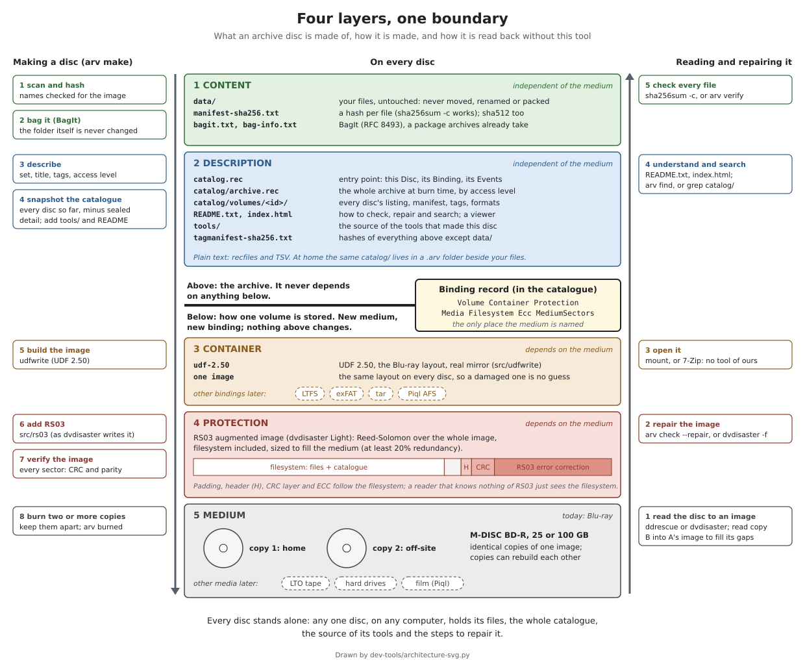

# Architecture: four layers, one boundary

How an archive disc is built, layer by layer, and why the layers are kept apart. Why the
project works this way: [philosophy.md](philosophy.md). Every field and file in detail:
[smart-archive-format.md](smart-archive-format.md).



(Drawn by `img/architecture-svg.py`; edit the script and run it to change the picture.)

## The layers

| # | Layer | What it is | On the disc | Depends on the medium? |
|---|---|---|---|---|
| 1 | **Content** | The files, untouched, and a hash of each | `data/`, `manifest-sha256.txt`, `manifest-sha512.txt`, `bagit.txt`, `bag-info.txt` (a BagIt bag, RFC 8493) | no |
| 2 | **Description** | What the files are, and the whole archive they belong to | `catalog.rec`, `catalog/archive.rec`, `catalog/volumes/<id>/`, `README.txt`, `index.html`, `tools/`, `tagmanifest-sha256.txt` | no |
| 3 | **Container** | How one volume is laid out on its medium | UDF 2.50, the Blu-ray standard, with a metadata partition and a real mirror | **yes** |
| 4 | **Protection** | Repair for that medium | dvdisaster RS03 data appended after the filesystem | **yes** |
| | *Medium* | The physical thing | M-DISC BD-R, two or more identical copies kept apart | **it is the medium** |

Layers 1 and 2 are the archive. Layers 3 and 4 are one way of storing a volume of it.

**Content.** The files are copied as they are: no compression, no packing, no renaming. BagIt
adds a manifest with one hash per file, so `sha256sum -c manifest-sha256.txt` checks them on
any system, and archives that ingest BagIt (Archivematica, and Piql through it) take the disc
as it is.

**Description.** Plain text: recfiles for records, TSV for file lists. Each disc carries its own
record (`catalog.rec`) and a snapshot of the **whole** archive's catalogue at the time it was made
(`catalog/`), limited by each disc's access level. It also carries the source of the tools that
made it and `README.txt`, which says how to check, repair and search the disc. The BagIt tag
manifest (`tagmanifest-sha256.txt`) holds a hash of every one of these files.

**Container.** The exact UDF profile arv writes: [archival-udf.md](archival-udf.md). Today a disc image: UDF 2.50, the layout Blu-ray players and recorders expect,
which current Windows, macOS and Linux read. There is one kind of image, on purpose: whoever
finds a damaged disc never has to guess its layout. (Older discs written as ISO 9660 + UDF 1.02
hybrids stay readable.)

**Protection.** dvdisaster's RS03 adds Reed-Solomon error correction over the whole image,
filesystem included, sized so the image fills the medium with at least 20% redundancy. A
program that knows nothing of RS03 just sees the filesystem; dvdisaster can rebuild unreadable
sectors from the rest.

## The boundary

**Nothing in layers 1 and 2 may depend on layers 3 and 4.** A file's path is relative to
`data/`, its identity is its SHA-256, and apart from the Binding records below, the catalogue
never mentions sectors, block addresses or error-correction parameters. So:
- the same bag and catalogue can be written to a disc image, a tape, a hard drive or film
  without changing a byte of them;
- a later disc (or another program) can read the catalogue without knowing how earlier discs
  were stored;
- the container and the protection can be replaced when better ones come along.

The one record that crosses the boundary is the **Binding**: one per volume, kept in the
catalogue, saying how that volume is stored.

```rec
Volume: TRIP-01_2019_4
Container: udf-2.50
Protection: rs03
Media: M-DISC BD-R 25GB
Filesystem: UDF 2.50, BD-ROM layout with metadata partition and a real mirror (arv udfwrite)
Ecc: dvdisaster RS03 augmented image, BD-R 25GB (12219392 sectors), minimum 20% redundancy
MediumSectors: 12219392
```

It describes layers 3 and 4, but nothing in layers 1 and 2 reads it. A new medium needs a new
kind of Binding (`Container: ltfs`, say), not a new format.

## Making a disc

`arv make FOLDER` runs these steps in order (the left side of the picture). Each is a small step on
plain files, so any one of them can be replaced (plan.md, "a chain of small programs").

| Step | Layer | Done by |
|---|---|---|
| 1. Scan the folder, hash every file, check names against the image's limits | content | `arv` |
| 2. Write the bag: manifests and `bag-info.txt`. The source folder is never changed; it is grafted into the image as `data/` | content | `arv` |
| 3. Describe: set, title, tags, access level; optionally suggestions from a local model | description | `arv` |
| 4. Snapshot the whole catalogue onto the disc; add `tools/`, `README.txt`, `index.html`, the tag manifests | description | `arv` |
| 5. Build the image | container | `udfwrite` (UDF 2.50, arv's own writer, built into arv) |
| 6. Add RS03, sized to the medium | protection | dvdisaster Light (or the speed47 fork; byte-identical output) |
| 7. Verify the finished image | protection | `dvdisaster -t` |
| 8. Burn two or more copies, keep them in different places, record it | medium | any burner; `arv burned` |

At home, the catalogue lives in a `.arv` folder beside your files, laid out exactly like
`catalog/` on a disc, plus settings (`config/`), work in progress (`drafts/`) and rebuildable
indexes (`cache/`). See the README, "Where the catalogue lives".

## Reading a disc, without this tool

The right side of the picture, from the bottom up. Nothing here needs `arv`; it is on the disc
anyway, in `tools/`.

| Step | Layer | With |
|---|---|---|
| 1. Read the disc to an image. With two damaged copies, read copy B into copy A's image: only the missing sectors are read | medium | `ddrescue` (with its map file), or `dvdisaster -r` (`--ignore-iso-size` if the RS03 header itself is unreadable) |
| 2. Repair the image | protection | `arv check --image disc.iso --repair` (the disc's `tools/arv.com`), or `dvdisaster -f` |
| 3. Open it | container | mount it, or 7-Zip; current Windows, macOS and Linux read UDF 2.50 |
| 4. Understand it and find things | description | `README.txt`, `index.html`, `grep` in `catalog/`, or `arv find` |
| 5. Check every file | content | `sha256sum -c manifest-sha256.txt`, or `tools/bagit.py --validate` |

A healthy disc skips steps 1 and 2: put it in a drive and open it.

## What makes it robust

- **Every disc stands alone.** Any one disc holds its files, the whole catalogue, the source of
  its tools and the steps to repair it.
- **Copies.** Identical copies of one image in different places. Two damaged copies can rebuild
  each other (tested; research-notes.md, section 8).
- **Few moving parts.** No extra layers that need their own repair (no PAR2). If encryption is
  added, RS03 still sits underneath it, protecting the encrypted image.
- **Plain text and open standards.** BagIt, recfiles, TSV, UDF, and tools that come as source.

## Not built yet

- **File extents** (`catalog/volumes/<id>/extents.tsv`): where each file starts in the container,
  kept in the home catalogue and on every later disc (not on the disc itself, whose own map is the
  UDF metadata and its mirror), so a badly damaged disc's map survives on its siblings.
- **Other bindings**: LTFS, exFAT, tar, a Piql AFS table of contents.
- **A small portable RS03 decoder** (C, also WebAssembly), and an RS03 library if dvdisaster
  Light splits into libraries ([issue](https://github.com/teaching-droid/dvdisaster-light/issues/1)).
- **A userspace UDF 2.50 reader**, so files can be read from an image without mounting it.

Details and the reasons: [plan.md](../research/plan.md), "four layers" and "a chain of small programs";
[research-notes.md](../research/research-notes.md), sections 7 to 9.
