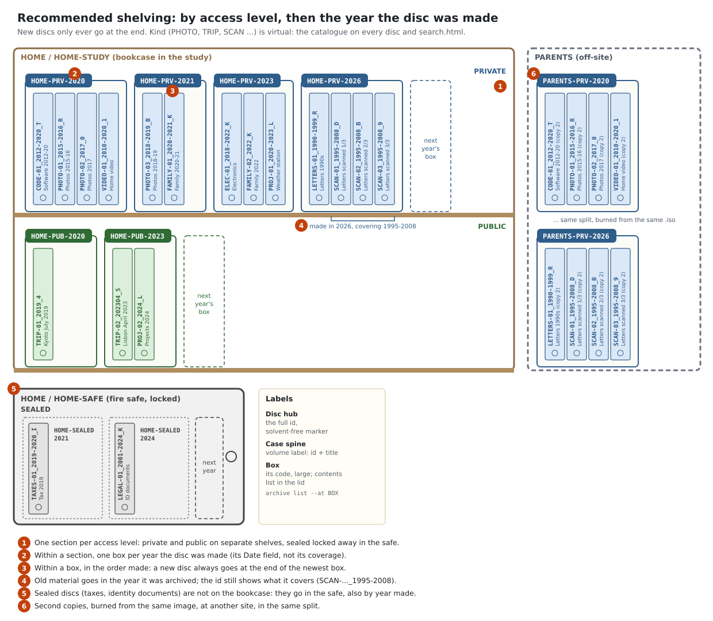
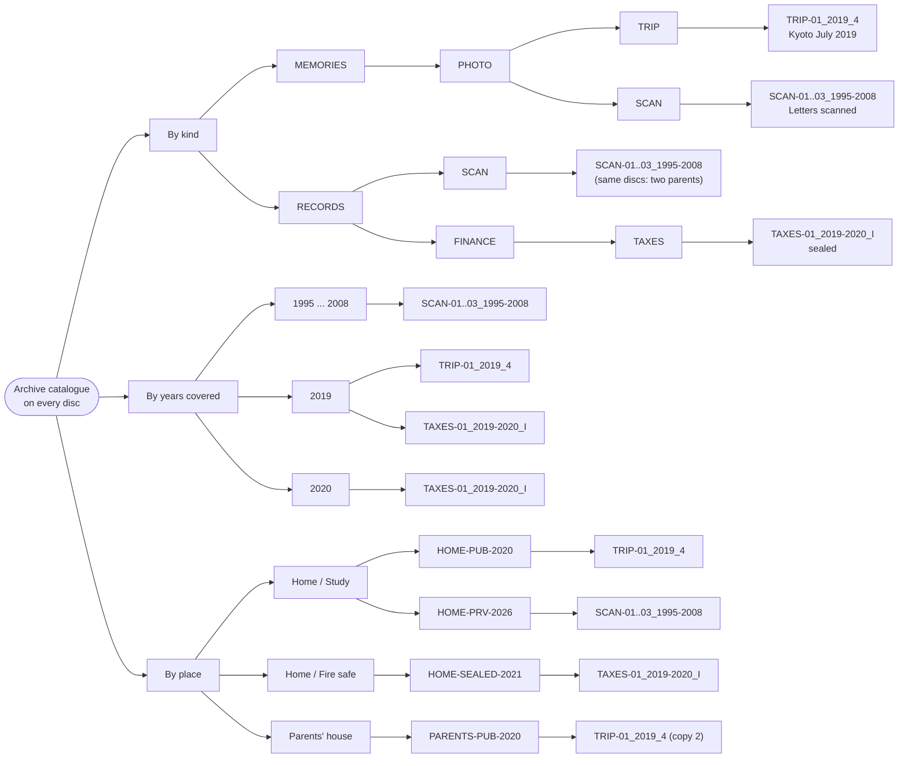

# Organising the physical discs

The tool doesn't know where a disc is; it only knows what you record with
`arv locate`, `arv burned --location` and `arv location`. This guide
recommends a physical arrangement that matches the catalogue, so the shelf and
the records stay easy to keep in step and anyone can find a disc from its id
alone.

## The rule: physically by access level and year, virtually by kind

The physical shelf answers "where is it?" and "who may open it?". The catalogue
answers "what is it?". So the two are arranged differently:

1. **One section per access level** (`public`, `private`, `sealed`; see
   `arv access`). Sealed discs (taxes, identity documents) go in the safe.
   Private and public discs go on the shelf, in separate boxes, so a public box
   can be lent or copied for family without thinking about what else is in it.
2. **Within a section, one box per year the disc was made**: the year in its
   `Date` field, not the years it covers. When a year fills a box, start a
   second one (`HOME-PRV-2024-2`).
3. **Within a box, in the order made.** A new disc always goes at the end of the
   newest box, and `arv list` lists discs in that order.

Kind (PHOTO, TRIP, SCAN …) isn't physical at all. A disc with several categories
still has exactly **one** shelf place, and the catalogue on every disc (read by
catalogue software or `arv find`) shows it under every kind it belongs to
(next section). Don't make physical copies to file a disc under each kind.



(Drawn by `img/shelving-svg.py`. The ids are real, computed with the tool's id
rules; the years made are illustrative.)

### Why the year made, not the years covered

The year made has one property the alternatives lack: **it only ever moves
forward**, so the shelf never has to be reshuffled.
- **Discs span years.** `SCAN-01_1995-2008` covers fourteen of them but was made
  in one.
- **Old material keeps arriving.** Letters from the 1990s scanned in 2026 go in
  the 2026 box, at the end. Shelving by coverage would mean squeezing them in
  between discs made years ago.

The coverage isn't lost: it is in every id (`PHOTO-03_2018-2019_B`), so a box is
easy to scan by eye for dates, and `arv list --covers 2019` finds every disc
with something from 2019, wherever it is shelved.

Shelving by kind (set, then sequence number) also works, and is the other
reasonable choice if you prefer it, because sequence numbers only grow too. It
needs room left at the end of every set, though, while year boxes only ever grow
at one place.

## The virtual structure: by kind, and every other order

Physically a disc can be in only one place. In the catalogue it can be in many,
and catalogue software can show any of these trees from the newest disc alone
(see [the format spec](smart-archive-format.md#building-a-virtual-file-system-from-the-catalogue)):
- **by kind**, through the vocabulary: the main view, where a disc appears under
  each of its paths;
- by the years covered, from each disc's coverage;
- by place, from the location records (which mirror the shelf: access level,
  then year made);
- by collection and by tag.



So the physical shelf only has to be **stable and easy to keep**, and the
virtual structure gives you every other order, most of all the one by kind.

## Location codes: down to the box, not the slot

Record locations down to the **box** (or case, or binder), not the position
inside it. Boxes are small and in the order made, and not tracking slots means
re-shelving never makes the records wrong.

```sh
arv location add HOME "Home"
arv location add HOME-STUDY "Study" --in HOME
arv location add HOME-PRV-2026 "Private, made 2026" --in HOME-STUDY
arv location add HOME-PUB-2026 "Public, made 2026" --in HOME-STUDY
arv location add HOME-SAFE "Fire safe" --in HOME
arv location add HOME-SEALED-2026 "Sealed, made 2026" --in HOME-SAFE
arv location add PARENTS "Parents' house"
arv location add PARENTS-PRV-2026 "Private copies, made 2026" --in PARENTS
```

- **Codes:** short, written large on the box itself, site first, then access
  level, then year (`HOME-PRV-2026`, `PARENTS-PRV-2026`), so the code says which
  site it belongs to even after a box moves. Codes allow 1–24 capital letters,
  digits, `-` and `_`.
- **Names:** say what's inside. They show up in `arv list`, `arv find` and
  every disc's catalogue ("stored at Home / Study / Private, made 2026").
- **Which box a new disc goes in:** `arv list --access private --made 2026`
  lists the discs that belong in `HOME-PRV-2026`.
- **Moving a box:** `arv location move HOME-PRV-2020 --in PARENTS` moves
  every disc in it.

## Copies: same image, different places

Burn every copy from the **same `.iso`**, so the copies are sector-identical and
can repair each other (see [workflow.md](workflow.md#6-recover)). Keep at least
two copies, in two places: the usual 3-2-1 idea, with an off-site copy.

```sh
arv burned SCAN-01_1995-2008_D --copies 1 --location HOME-PRV-2026
arv burned SCAN-01_1995-2008_D --copies 1 --location PARENTS-PRV-2026
arv list --at PARENTS          # what the off-site boxes hold
```

The off-site boxes follow the same split. Sealed copies need somewhere locked
there too (a second safe, or a bank's safe deposit box).

## Labels

| Where | What | How |
|---|---|---|
| On the disc | the **full id**, e.g. `TRIP-01_2019_4` | a solvent-free (water-based) marker meant for discs, on the clear inner hub ring only. No paper labels. |
| Case spine | the volume label: the id, then the title, e.g. `TRIP-01_2019_4 Kyoto July 2019` | printed or written spine insert |
| Box | its location code, large, and its contents list | print `arv list --at HOME-PRV-2026` and keep it in the box lid |

The id's last character is a check character, so a smudged or misread id is
caught: `arv id` says whether an id is valid, and suggests the likely disc.

## Care

Handling and storage, following the usual advice for optical media (for
example NIST SP 500-252, *Care and Handling of CDs and DVDs: A Guide for
Librarians and Archivists*):

- Store discs **upright in their cases**, like books, not stacked flat or loose.
- Keep them **cool, dry and dark**, with stable temperature and humidity. Avoid
  attics, garages, outside walls, sunny shelves and cars.
- Handle them **by the edges**, and don't flex them.
- Write only on the hub, with a solvent-free marker. Adhesive labels can peel or
  unbalance a disc.

M-DISC media resist ageing better than ordinary BD-R, but cases, storage
conditions and copies in more than one place still matter.

## Checking over time

- Every few years, **read one copy of every disc fully**:
  `arv check --device /dev/sr0` logs a fixity-check event.
- Alternate which copy (home or off-site) you check.
- A disc that needed repair is a warning sign: burn a fresh copy from a good
  image, record it with `arv burned`, and retire the weak one.
- `arv list` shows copies and locations, so discs with only one copy, or
  with all copies at one site, are easy to spot.

## What this buys you

With the shelf by access level and year, and locations recorded per box, every
index points to a physical place:
- `arv find`;
- `arv --home catalog find` run from any disc;
- a virtual tree in catalogue software, "by place", for example
  `Home/Study/HOME-PUB-2020/TRIP-01_2019_4/…` (see
  [the format spec](smart-archive-format.md#building-a-virtual-file-system-from-the-catalogue)).

Inside the box, discs are in the order made, the same order as the lid's list.
