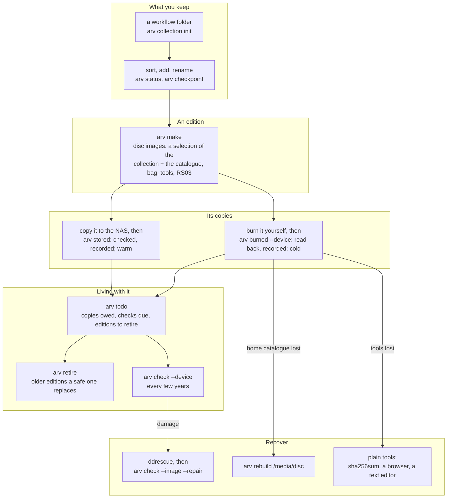

# The whole workflow

This document follows the whole system: from the things you keep on your computer to copies
on a shelf, through years of finding and checking them, to recovering from damage or loss. It
also says where each part of this repository fits.

**This is archiving, not backup.** Backups (the NAS, restic, Borg, the cloud) hold everything
as it is now and are replaced by the next one; keep them. The archive holds what you chose to
keep, in *editions* — sets of discs, each holding a selection of the collection and a copy of
the catalogue — kept **cold** (offline, on a shelf) wherever possible, and recorded well enough
to outlive the software and the person who made it ([philosophy.md](philosophy.md)).

Details live elsewhere and are linked: the model behind the commands in
[concepts.md](concepts.md), the command reference in [README.md](../README.md), the on-disc format
in [smart-archive-format.md](spec/smart-archive-format.md), burning in [burning.md](burning.md),
shelving in [shelving.md](shelving.md), and the reasons for each choice in
[research-notes.md](../research/research-notes.md) and [plan.md](../research/plan.md).

## The whole thing on one page



## The words

| Word | Meaning |
|---|---|
| **archive** (home) | one archive's catalogue: a `.arv` folder with its own identity (`arv where` shows it). Each archive is its own privacy sphere: its discs carry its catalogue only |
| **collection** | something kept over time, e.g. *Family photos*: one **workflow folder**, one code (`FAMILY`), one history |
| **revision** | one recorded state of a collection, as a git commit: a **checkpoint** (hashes only, nothing copied) or an **edition** |
| **edition** | a set of discs made together from a collection; each disc holds a selection of it and a copy of the catalogue; numbered; replaced by a newer safe edition unless **kept** |
| **copy** | one physical or stored copy of a disc: a burned **disc**, the image as an **iso** file, or the disc's files as a **folder**; each with a place and a **temperature** |
| **temperature** | **hot**: in active use; **warm**: online or reachable, left alone (an image on a NAS); **cold**: offline (discs on a shelf, unplugged drives) |
| **safe** | an edition whose every disc has a copy read back identical to its image |

## Before the archive: everyday storage

The archive holds a curated selection; everything lives first on everyday storage, which is
robust enough for years, not decades. Suggested setup (the tools named here are not part of
this repository and were not tested in it):

| Need | Suggested | Why |
|---|---|---|
| Master copy that notices bit rot | The NAS on **ZFS or Btrfs**, scheduled scrubs, snapshots | checksums every block, repairs from redundancy; snapshots undo mistakes |
| A pile of mismatched hard drives | **SnapRAID + mergerfs**, or plain `rsync` mirrors checked with **chkbit** / hashdeep | files stay ordinary on each drive (any one drive readable alone); parity or checksums catch rot |
| History and an off-site copy | **restic/rustic**, Borg or Kopia; **rclone** for cloud | compact and versioned; tool-dependence is acceptable on this tier |
| Clean up before choosing | duplicate finders (Czkawka, rmlint, jdupes); photo managers (digiKam ratings and tags go into XMP) | less to sort; ratings can feed appraisal |
| "Which drive or disc is it on?" | **Katalog** | catalogues offline drives and, through our format, the discs |
| What is already archived | **arv status** on any folder | which of its files are on which discs, and which on none |

Organise the NAS in plain folders by the same kinds as the archive vocabulary (photos,
projects, records ...).

## 0. One-time setup

| Need | For | How |
|---|---|---|
| a C compiler | building arv (`make`) | usually installed (`build-essential`) |
| `arv` | everything below | `make install PREFIX=~/.local` in this repository (or run `./arv` from it); `make uninstall PREFIX=~/.local` removes it and leaves your catalogues alone |
| `7z`, `git` | reading images in checks; arv's source in each disc's `tools/` | your distribution |
| a burning program | burning images (arv never burns) | `xorriso`, or your system's own: see [burning.md](burning.md) |
| optional | reading damaged discs; format ids; AI help; the interface | GNU ddrescue or [dvdisaster Light](https://github.com/teaching-droid/dvdisaster-light); Siegfried (`sf`); arv-assist (`arv describe`, `arv tag`); Python 3 for `arv gui` |

Make the **archive** (its home catalogue) at the root of the tree it describes, for example the
NAS share above your photos and projects:

```sh
cd /nas && arv init --name family --default   # /nas/.arv: the archive's catalogue, with its identity
cd ~/git && arv init --pointer /nas/.arv      # another tree of the same archive: a pointer file
arv where                                     # which archive is used here, and why
```

`arv` finds the home by walking up from the folder it works on or the current folder, then
falls back to the default home registered on this machine. The home holds `config/` (your
vocabularies), `catalog/` (`archive.rec`: every disc, copy, place, collection, revision and
event; `volumes/<disc-id>/`: each disc's manifest and listing; `revisions/`: each revision's
manifest), `drafts/`, and `cache/` (models and the hash cache; rebuildable). Back it up: it is
small, and every disc carries a copy of it too.

Set up **where copies live** once, with how warm each place is:

```sh
arv location add HOME "Home"
arv location add HOME-2026 "Home, box of 2026" --in HOME --temperature cold
arv location add PARENTS "Parents' house" --temperature cold
arv location add NAS "The NAS" --temperature warm
```

## 1. A collection and its workflow folder

A **collection** is something you keep over time: the family photos, a project, the tax
records. Its **workflow folder** is where you sort it. arv writes one small `.arv` marker
there (with the collection's identity) and nothing else; the marker never goes on a disc.

```sh
arv collection init ~/family --code FAMILY --title "Family photos" --set PHOTO --access private
```

The collection gives every edition its title, set, categories and access, so `arv make` asks
nothing. Its code starts the disc ids (`FAMILY-04_2001-2025_X`).

Before the first edition, check the names: `arv names ~/family`. UDF 2.50 keeps names up to 254
characters exactly on every system, but Windows shows `< > : " \ | ? *` changed, and only one of
two names that differ in letter case.

Optional: `arv tag FOLDER --save d.json` suggests folder tags from your vocabulary, and `arv
describe FOLDER --save d.json` asks a local language model for a title, description and
questions; `arv make --draft d.json` takes either.

## 2. Sort, and see what changed

Work in the folder as you like. arv tells you what changed since the last edition, and keeps a
history if you want one between editions:

```sh
arv status ~/family          # new, changed, removed and moved files since the last revision
arv checkpoint ~/family --message "sorted 2019"   # record this state (hashes only, nothing copied)
arv log FAMILY               # the revisions: checkpoints and editions
arv diff FAMILY/3            # edition 3 against the folder now; or arv diff FAMILY/2 FAMILY/3
```

A second `status` reads almost nothing: hashes are cached by path, size, modified time and
inode, and `arv make` fills the cache. `--deep` reads everything again, and reports any file
whose content changed while its time did not (bit rot, or a tool that keeps times).

**Folders arv does not know yet.** `arv status` on any folder says which of its files are on
which discs and which are on none, and which discs it most resembles. To say what a folder is
without writing in it: `arv link FOLDER FAMILY` (it is that collection's workflow folder),
`arv link FOLDER DISC-ID` (it is the source of that disc), or `arv link FOLDER FAMILY --past`
(an older state kept for reference). Every link is logged.

**Git repositories** are recognised by their history, wherever they are and whatever the folder
is called: `arv status` says, for each repository in a folder, whether its HEAD is already on a
disc, how many commits newer it is than a branch on a disc, whether it has diverged (and how many
commits are on no disc), or whether no disc holds its history at all; and whether it has
uncommitted changes. `arv find COMMIT` names the discs that hold a commit. On a disc, a
repository is its working files plus a compacted `.git` (one pack; no hooks, no reflogs but the
stash's, no credentials in remote URLs), so the restored folder is a working repository; `arv
make --git-since DATE` keeps only the history since then (shallow, as git itself does it).

## 3. Make an edition

```sh
arv make ~/family [--message "the 2025 sort"] [--keep] [--medium bd25|bd100] [--split]
```

Each `make` on a workflow folder is the collection's next **edition**: a set of discs made
together, not just the changes, each holding a selection of the collection and a copy of the
catalogue. `--keep` marks one that must never be retired (a milestone; or later,
`arv collection keep FAMILY 4`).

A folder that is not a collection works too (`arv make FOLDER --set TRIP`): a one-off disc, as
arv always made. The choices that matter then:

| Option | Default | Choose otherwise when |
|---|---|---|
| `--set` / `--category` | guessed from the folder name and the files (vocabulary aliases and match rules) | the guess is wrong; `arv sets -v` shows the vocabulary |
| `--medium` | `bd25` (about 20 GB of data at 20% RS03) | `bd100` for BDXL M-DISC |
| `--access` | `private`: your own archive's discs only | `public` to appear on discs you give away; `sealed` so other discs carry only its id and location |
| `--snapshot` | `full`: every disc carries the whole catalogue | `set` for a disc given to someone else |
| `--split` | off: stop if it does not fit | the folder needs several discs |

### What `arv make` does, step by step

1. **Scan and hash** every file (SHA-256 and SHA-512); stop on names the image cannot hold.
2. **Classify**: one `Set` and any `Category` codes from `sets.rec`, every vocabulary path
   recorded; **coverage** is the files' date range (EDTF).
3. **Plan**: disc ids with a check character (`FAMILY-04_2001-2025_X`), files fitted to the
   medium at the minimum RS03 redundancy, split over discs with `--split`. Sizes are exact.
4. **Stage each disc**: BagIt files, `catalog.rec` (the disc, its collection and edition, the
   archive it belongs to), `catalog/` (the whole archive's catalogue, limited by access),
   `index.html`, `README.txt` (how to verify, restore and repair it by hand), and `tools/` (arv's
   source and the specs, plus `arv.com` when built).
5. **Build** a UDF 2.50 image (arv's own writer). Symbolic links never reach the disc: they are
   copied or noted in the listing (`--links`), and the choice is logged.
6. **Protect**: RS03 error correction fills the rest of the medium (dvdisaster's format, written
   by arv itself), then every sector is tested.
7. **Record**: the discs, their events, and for a collection the edition (a `Revision` with its
   manifest) go into the home catalogue. The image's SHA-256 is kept, to check every copy against.

Output: one `.iso` per disc, and the commands to burn and record it.

## 4. Copies: burned, and stored

arv never burns and never copies files to a NAS: those are jobs for tools built for them. It
checks each copy against the image and records it, with its place and temperature.

```sh
xorriso -as cdrecord -v dev=/dev/sr0 -eject FAMILY-04_2001-2025_X.iso       # or your own burner
arv burned --device /dev/sr0 --location HOME-2026      # read back; recorded only if identical; cold
arv burned --device /dev/sr0 --location PARENTS        # the second copy, the same way

cp FAMILY-04_2001-2025_X.iso /nas/archive/             # a warm copy, if you like
arv stored FAMILY-04_2001-2025_X /nas/archive/FAMILY-04_2001-2025_X.iso --location NAS
```

- A burn that does not read back identical is **not** recorded: burn again.
- `arv stored` takes the image file (read back like a disc) or the disc's files as a folder
  (`7z x` the image; verified file by file). It is warm unless its place says otherwise.
- `--temperature hot|warm|cold` overrides the place's.
- An edition is **safe** once each of its discs has a copy checked this way.

Write the disc id on the hub and the case; its last character is a check character, so a
mistyped id is caught (`arv id FAMILY-04_2001-2025_Y`). [burning.md](burning.md) has the burning
commands, the pitfalls and the drill to run before trusting a new drive or media.

## 5. Store

How to arrange the discs so the shelf matches the catalogue: **[shelving.md](shelving.md)**.
In short: physically by access level, a box per year made, in the order made (sealed discs in
the safe); virtually by kind, through the catalogue. Copies of the same image go to different
places, at least one of them cold.

```sh
arv list --access private --made 2026     # what belongs in this year's private box
arv locate FAMILY-04_2001-2025_X HOME-2026 PARENTS   # one location per place copies are kept
arv location move HOME-2026 --in PARENTS             # moving a box moves its discs
arv location list -v                                 # places, their temperature and their discs
```

## 6. Living with the archive

**`arv todo`** lists what is owed, and is the one command to run now and then:

- discs with no copy yet;
- copies never read back;
- editions not yet safe;
- editions a newer safe edition replaces, ready to retire;
- discs with no cold copy;
- discs kept in fewer than two places;
- checks overdue (5 years by default; `--overdue YEARS`).

**Retiring** an edition a newer safe one replaces (`arv retire FAMILY`) lists any files that
exist only on the discs being retired (removed from the collection since), and records nothing
until `--yes`. Then each disc is marked retired, leaves its places, and gets an event saying what
replaced it. arv deletes nothing: the discs are yours to keep or destroy.

**Checking** every few years: `arv check --device /dev/sr0` reads a disc back against its
image's hash and logs it. A disc that needed repair is a warning: make a new copy.

| Question | Answer |
|---|---|
| Which disc has this file, and where is it? | `arv find IMG_2019` (a glob works: `'*.kicad_pcb'`) |
| What do I have from July 2019? | `arv list --covers 2019-07` |
| Everything under a category or a place | `arv list --in MEMORIES`, `arv list --at PARENTS` |
| What has this collection been through? | `arv collection show FAMILY`, `arv log FAMILY` |
| Which tags do I use? | `arv tags`; `arv find place:kyoto` |
| Group things across discs | `arv selection add BEST --name "Best of" DISC:folder/ DISC:file`: virtual folders, shown as a tree by other software too |
| Without this tool installed? | every disc carries it: `tools/arv.com find PATTERN` from the disc's root searches every disc it knows about; or `grep -ri PATTERN catalog/volumes/*/listing.tsv` |
| Changes after burning | `arv note`, `arv locate`, `arv access` (home catalogue; later discs carry them) |
| How important is it, and to whom? | `arv appraise` (the archivist's log; `make --importance` at the start) |

Every new disc carries the whole archive's catalogue as of its making, so **the newest disc is
always a copy of the catalogue**.

## 7. Recover

| What happened | What to do |
|---|---|
| A disc reads with errors | Follow REPAIR in the disc's `README.txt`: read it into an image (`ddrescue -b 2048 /dev/sr0 disc.iso disc.map`, or dvdisaster Light `-r --rescue`), then `arv check --image disc.iso --repair` (the disc's own `tools/arv.com` works too). Too damaged? Copies are sector-identical: read another copy into the same image (the same map file) and repair again; a stored iso is such a copy. When arv cannot repair, it prints the dvdisaster Light commands to paste, with the disc's medium size from the catalogue. Then make a new copy. |
| The home catalogue is lost | `arv rebuild /media/disc` with the newest disc: discs, copies, places, collections, their history, file lists, and the archive's identity. A disc of another archive is refused (`--any-archive` to merge it anyway). |
| This tool is lost | every disc has `tools/` (the source at that time) and `README.txt`. Without it: `sha256sum -c manifest-sha256.txt` verifies, `index.html` browses, `grep` searches `catalog/volumes/*/listing.tsv`, and `catalog.rec` is plain text. |
| dvdisaster is lost | arv repairs RS03 itself; the format is written up in [rs03-format.md](spec/rs03-format.md) (on every disc), with test vectors. A copy of dvdisaster can go in `tools/extra/` with `--extra-tools`. |
| Decades later, unknown software | [smart-archive-format.md](spec/smart-archive-format.md) (on every disc under `tools/`) explains every file; BagIt is RFC 8493; recfiles are plain text. |

The rule behind all of this: **the discs describe themselves**. Nothing on a disc needs this
tool, the home catalogue or the network to be found, verified, read or repaired.

## 8. How the repository fits together

```
src/arv/                  arv: the C program (C99 and POSIX, no libraries)
  arv.c                   the commands; runs arv-assist for describe, tag, models and arv-gui for gui
  make.c  bag.c  html.c  rocrate.c  formats.c   making discs (plan, stage, build, protect)
  collection.c  status.c  upkeep.c              collections, revisions, status, copies owed, retiring
  record.c  edit.c  tags.c  catalogue.c  disc.c recording copies and checks, editing, queries, reading a disc
  archive.c  home.c  rec.c  json.c  vocab.c  discid.c  edtf.c   the catalogue and its rules
  data/                   descriptors.rec  readme.txt  index.css  default_sets.rec  default_tags.rec
src/arv-assist/           optional, C: the local AI helpers (describe, tag, models); they write drafts
src/arv-gui/              optional, Python standard library only: the local web interface
src/bagit/  src/rs03/  src/udfwrite/   BagIt checking, RS03, the UDF 2.50 writer (built into arv; also programs)
arv                       runs src/arv/build/arv in a checkout (make first if needed)
samples/                  six small sample discs and their catalogue; the scripts that make them
tests/                    reference outputs (every command, frozen), fixtures, arv-gui's tests
docs/                     this file, burning, shelving, architecture, philosophy, the website
docs/spec/                the disc format, the UDF profile, RS03
dev-tools/                not part of arv: test helpers, the spec cross-check, diagrams, screenshots
research/                 research notes, standards survey, plan and decisions, RS03 experiments
upstream/                 not part of arv: drafts for other projects, and bagit-python as a referee
scripts/                  the original shell scripts, before arv
```

The layers, from most to least durable:
1. **Formats:** BagIt, recfiles, TSV, EDTF, and [the spec](spec/smart-archive-format.md). They
   outlive any code.
2. **arv** (with bagit, rs03 and udfwrite built in): C99 and POSIX, built from any disc with one
   `cc` line, or carried ready to run as `tools/arv.com`.
3. **The optional helpers:** arv-assist (local AI helpers) and arv-gui (the web interface).
   Nothing on a disc needs them.

## 9. Developer flows

- **Tests:** `make check` runs bagit (against bagit.py when python3 is there), RS03 (the test
  vectors, and dvdisaster Light when on PATH), arv (`make -C src/arv check`: the reference
  outputs, a real disc, Siegfried when on PATH; `check-ape` with arv.com), arv-assist (against a
  fake model server), then arv-gui (`python3 -m unittest discover -s tests`).
- **Reference outputs:** `make -C src/arv check` holds arv to
  [tests/reference/expected](../tests/reference/); after an intended change,
  `sh tests/reference/generate.sh` (or `just bless`), then read `git diff tests/reference/expected`.
- **Fixtures:** edited by hand, with the expected value worked out ([README](../tests/fixtures/README.md)).
- **Sample discs:** `samples/make-samples.sh` replaces `samples/discs` and `samples/home`;
  `samples/publish-discs.sh` publishes the images as the `samples` release, and
  `samples/fetch-discs.sh` downloads them.
- **Screenshots:** `sh dev-tools/screenshots.sh` retakes `docs/screenshots/` from the samples.
- **Upstream work** (`upstream/`, not built by `make`): nothing there is sent without a decision
  to send it; its README says what has been.
- **Format changes:** update [smart-archive-format.md](spec/smart-archive-format.md) first, and
  bump its version for anything a reader must know. Before 1.0 there is no compatibility with
  earlier drafts: nothing has been burned yet.
