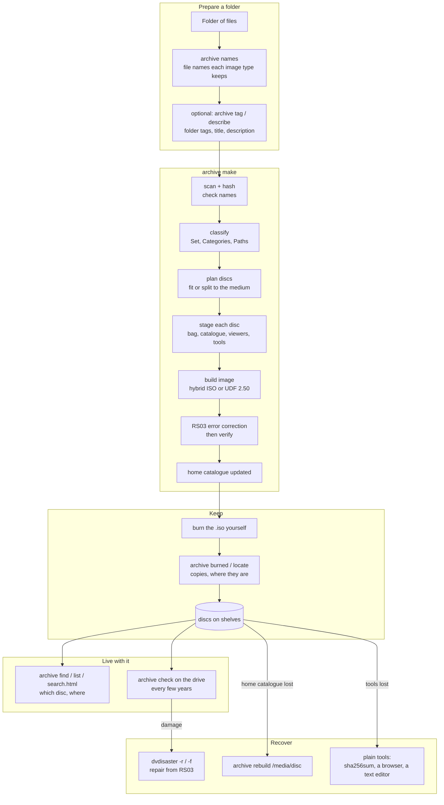

# The whole workflow

This document follows the whole system: from a folder on your computer to discs
on a shelf, through years of finding and checking them, to recovering from
damage or loss. It also says where each part of this repository fits.

Details live elsewhere and are linked:
- the command reference is in [README.md](../README.md);
- the on-disc format is in [smart-archive-format.md](smart-archive-format.md);
- the reasons for each choice are in [research-notes.md](research-notes.md) and [plan.md](plan.md).

## The whole thing on one page



## 0. One-time setup

| Need | For | How |
|---|---|---|
| Python 3.8+ | everything (standard library only) | usually installed |
| `genisoimage` | the default hybrid image | `apt install genisoimage` |
| `dvdisaster` | RS03 error correction | the [speed47 fork](https://github.com/speed47/dvdisaster) fills a whole BD; the stock 0.79.10 build works but pads to the smallest standard size |
| `lib/udfmake` | only for `--filesystem udf250` | `make -C lib/udfmake` (a C compiler; nothing else) |
| optional | format IDs, tagging, descriptions | Siegfried (`sf`); `archive models fetch` for `archive tag`; a local LLM server for `archive describe` |

The **home catalogue** is created on first use in `~/.local/share/bluray-archive`
(or `$BLURAY_ARCHIVE_HOME`, or `--home`). It holds:
- `archive.rec`: every disc, event and location;
- per-disc manifests, listings and tags;
- your vocabularies (`sets.rec`, `tags.rec`);
- a disposable SQLite index.

Back this folder up. It is small, and every disc also carries a copy of it (see
[Recover](#6-recover)).

Set up **where discs live** once. You can extend it later:

```sh
archive location add HOME "Home"
archive location add BOX1 "Box 1, blue lid" --in HOME
archive location add OFFSITE "Parents' house"
```

## 1. Prepare a folder

One folder becomes one disc, or a set of discs if it is too big. The folder is
never modified. Group things the way you would look for them later: a trip, a
project, a year of paperwork.

1. **Check the names:** `archive names FOLDER`.
   - Linux sees exact names on either image type.
   - The hybrid image shortens names to 103 characters for Windows and macOS, and replaces `* : ; ? \`.
   - UDF 2.50 keeps names up to 254 characters.
   - Rename anything you care about now.
2. **Optional: tags and descriptions.**
   - `archive tag FOLDER --save d.json` suggests folder tags from your vocabulary. It uses match rules and a small built-in model, and you review each suggestion.
   - `archive describe FOLDER --save d.json` asks a local LLM for a title, description and questions.
   - Both write a draft that `make` uses with `--draft d.json`.
   - Tags can be namespaced: `person:alice`, `place:kyoto`.

## 2. Make the disc image

```sh
archive make FOLDER --location BOX1 [--set trip] [--category scan] [--access private]
                    [--medium bd25|bd100] [--filesystem hybrid|udf250] [--split] [--draft d.json]
```

The choices that matter:

| Option | Default | Choose otherwise when |
|---|---|---|
| `--set` / `--category` | guessed from the folder name and the files (vocabulary aliases and match rules) | the guess is wrong; `archive sets -v` shows the vocabulary |
| `--medium` | `bd25` (about 20 GB of data at 20% RS03) | `bd100` for BDXL M-DISC |
| `--filesystem` | `hybrid`: readable almost anywhere, ISO 9660 fallback | `udf250`: longer names on Windows/macOS, Blu-ray style (no metadata mirror yet) |
| `--access` | `private`: your own discs' catalogues only | `public` to appear on discs you give away; `sealed` so other discs carry only its id and location |
| `--snapshot` | `full`: every disc carries the whole catalogue | `set` for a disc given to someone else (public discs of that set only) |
| `--split` | off: stop if it doesn't fit | the folder needs several discs (`Bag-Count: n of N`) |
| `--label` | the title: the volume label is `ID Title`, cut to 32 bytes (hybrid) or 126 characters (UDF 2.50) | another text after the id, or `''` for the id alone |

### What `archive make` does, step by step

1. **Scan and hash** every file (SHA-256 and SHA-512). Symlinks and ambiguous
   names are refused. **Check names** for the chosen image type: stop on names it
   cannot hold, and list names Windows/macOS will see changed.
2. **Classify.** One `Set` (the id prefix) and any number of `Category` codes
   from `sets.rec`, with every vocabulary path recorded (`MEMORIES/PHOTO/TRIP`).
   **Coverage** is the date range of the files (EDTF), or `--coverage`.
3. **Plan.** It gives the disc an id derived from Set, Sequence and Coverage,
   plus a check character (`TRIP-01_2019_4`). It then fits the files onto the
   medium at the minimum RS03 redundancy, splitting across discs with `--split`.
   Sizes are exact: `genisoimage -print-size` for hybrid, and for UDF a real
   image is built and kept.
4. **Stage each disc** in a work folder:
   - BagIt files (`bagit.txt`, `bag-info.txt`, manifests, tag manifests);
   - `catalog.rec`: this disc's record, its locations and events, starting with the `Archive` entry record for other software;
   - `catalog/`: the snapshot of the whole catalogue, limited by access, with manifests, listings, tags and search data;
   - `index.html` and `search.html`: offline, no network;
   - `README.txt`: recovery instructions in plain text;
   - `tools/`: this repository at its last commit, plus `bagit.py`.
5. **Build the image.** The folder is grafted in as `data/` and never copied.
   The hybrid image uses `genisoimage`; UDF 2.50 uses `udfmake`, fed one folder
   of symlinks.
6. **Protect.** dvdisaster adds RS03 error correction in the space left on the
   medium, then `dvdisaster -t` verifies the result.
7. **Record.** The disc record and its events (PREMIS types: message digest
   calculation, creation, fixity check...) go into the home catalogue, with the
   manifests, listings and tags. The SQLite index is refreshed.

Output: `<disc-id>.iso`, ready to burn.

## 3. Burn and record

Burn the `.iso` yourself, with any burning program, as a disc-at-once burn of the
whole image. M-DISC BD-R is the standard medium here. Then record what you did:

```sh
archive burned TRIP-01_2019_4 --copies 2
archive burned TRIP-01_2019_4 --copies 1 --location OFFSITE --note "for the parents"
archive check --device /dev/sr0          # reads the whole disc once; logs a fixity-check event
```

Write the disc id on the disc and the case. The id's last character is a check
character, so a mistyped id is caught: `archive id TRIP-01_2019_5` tells you it's wrong.

## 4. Store

```sh
archive locate TRIP-01_2019_4 BOX1 OFFSITE    # one location per place copies are kept
archive location move BOX1 --in OFFSITE       # moving a box moves its discs
archive location list -v
```

## 5. Live with the archive

| Question | Answer |
|---|---|
| Which disc has this file, and where is it? | `archive find IMG_2019` (a glob works: `'*.kicad_pcb'`) |
| What do I have from July 2019? | `archive list --covers 2019-07` |
| Everything under a category or a place | `archive list --in MEMORIES`, `archive list --at OFFSITE` |
| Which tags do I use? | `archive tags`; `archive find place:kyoto` |
| Group things across discs | `archive collection add BEST --name "Best of" DISC:folder/ DISC:file`, `archive collection show BEST`: virtual folders; other software can show them as a tree ([spec](smart-archive-format.md#building-a-virtual-file-system-from-the-catalogue)) |
| Without this tool? | open `search.html` on any disc: it searches every disc it knows about |
| Changes after burning | `archive note`, `archive locate`, `archive access` (home catalogue; later discs carry them) |

**Check discs every few years** with `archive check --device /dev/sr0`.
- A disc that needed repair is a warning sign: copy it to new media.
- `archive list` shows copies and locations, so you know which discs have only one copy.

Every new disc carries the whole catalogue as of its burn date. So **the newest
disc is always a backup of the catalogue**.

## 6. Recover

| What happened | What to do |
|---|---|
| A disc reads with errors | `dvdisaster -d /dev/sr0 -r -i disc.iso` (read what's readable), `dvdisaster -i disc.iso -f` (repair from RS03), then burn a new copy. Copies from the same image are sector-identical, so another copy can fill in sectors RS03 cannot. |
| The home catalogue is lost | `archive rebuild /media/disc` with the newest disc: discs, events, locations, file lists. Then rebuild from later discs, or re-enter notes. |
| This tool is lost | every disc has `tools/` (the code at burn time) and `README.txt`. Without Python: `sha256sum -c manifest-sha256.txt` verifies, `index.html`/`search.html` browse and search, and `catalog.rec` is plain text. |
| dvdisaster is lost | a copy can go in `tools/extra/` with `--extra-tools`; keep one off-disc too. The RS03 format is documented by dvdisaster. |
| Decades later, unknown software | [smart-archive-format.md](smart-archive-format.md) (on every disc under `tools/`) explains every file; BagIt is RFC 8493; recfiles are plain text. |

The rule behind all of this: **the discs describe themselves**. Nothing on a
disc needs this tool, the home catalogue or the network to be found, verified,
read or repaired.

## 7. How the repository fits together

```
archive                    the command (python3 archive ...)
archivetool/               the workflow, Python standard library only
  cli.py                   commands
  make.py                  the make pipeline (plan, stage, build, protect)
  bag.py  catalog.py  recfile.py  discid.py  sets.py  names.py   formats and rules
  image.py                 genisoimage / udfmake / dvdisaster
  html.py  web.py  gui.py  viewers and the local web UI
  tagger.py  describe.py  llm.py  vision.py  models.py            optional AI helpers (local only)
  default_sets.rec  default_tags.rec                              starting vocabularies
lib/udfmake/               UDF 2.50 image builder in C: NetBSD makefs, extracted (our copy)
third_party/netbsd-makefs-udf/   upstream reference: bug report, one patch per bug, reproduction
samples/                   seven small sample discs and their catalogue; the scripts that make them
tests/                     unit and integration tests
tests/fixtures/            language-neutral test cases (TSV): the contract for a future port
docs/                      this file, the format spec, research and plan
```

The layers, from most to least durable:
1. **Formats:** BagIt, recfiles, TSV, EDTF, and [the spec](smart-archive-format.md). They outlive any code.
2. **C tools:** `udfmake`, and later an RS03 library. Low-level, reused as they are.
3. **Python workflow:** it can change freely while the workflow settles, and may be ported to C later ([plan.md](plan.md), decisions 2026-09-30).

## 8. Developer flows

- **Tests:** `python3 -m unittest discover -s tests`. Add `ARCHIVE_TEST_ECC=1` to include dvdisaster.
- **Fixtures:** after an intended behaviour change, run `python3 tests/fixtures/generate.py`, then read `git diff tests/fixtures` before committing ([README](../tests/fixtures/README.md)).
- **Sample discs:** `samples/make-samples.sh` (needs the speed47 dvdisaster and `lib/udfmake`) replaces `samples/discs` and `samples/home`.
- **udfmake:**
  - `make -C lib/udfmake check` (also `asan`, `static`);
  - changes to NetBSD's code go in `lib/udfmake/netbsd/`, and each also gets a patch in `third_party/netbsd-makefs-udf/patches/`;
  - `third_party/netbsd-makefs-udf/repro/repro.sh` shows each patch against unmodified upstream.
- **Format changes:** update [smart-archive-format.md](smart-archive-format.md) first, and bump its version for anything a reader must know.
