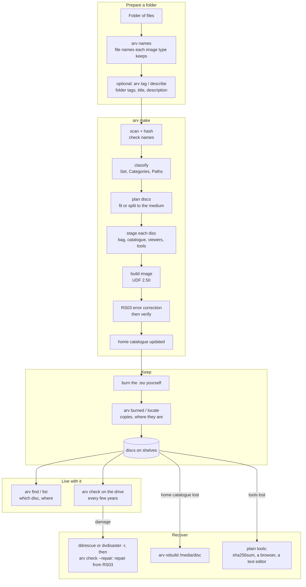

# The whole workflow

This document follows the whole system: from a folder on your computer to discs
on a shelf, through years of finding and checking them, to recovering from
damage or loss. It also says where each part of this repository fits.

Details live elsewhere and are linked:
- the command reference is in [README.md](../README.md);
- the on-disc format is in [smart-archive-format.md](smart-archive-format.md);
- the reasons for each choice are in [research-notes.md](../research/research-notes.md) and [plan.md](../research/plan.md).

## The whole thing on one page



## Before the discs: everyday storage

Discs hold a curated selection ([philosophy.md](philosophy.md)); everything lives first on
everyday storage, which is robust enough for years, not decades. Suggested setup (the tools
named here are not part of this repository and were not tested in it):

| Need | Suggested | Why |
|---|---|---|
| Master copy that notices bit rot | The NAS on **ZFS or Btrfs**, scheduled scrubs, snapshots | checksums every block, repairs from redundancy; snapshots undo mistakes |
| A pile of mismatched hard drives | **SnapRAID + mergerfs**, or plain `rsync` mirrors checked with **chkbit** / hashdeep | files stay ordinary on each drive (any one drive readable alone); parity or checksums catch rot |
| History and an off-site copy | **restic/rustic**, Borg or Kopia; **rclone** for cloud | compact and versioned; tool-dependence is acceptable on this tier |
| Clean up before choosing | duplicate finders (Czkawka, rmlint, jdupes); photo managers (digiKam ratings and tags go into XMP) | less to sort; ratings can feed appraisal |
| "Which drive or disc is it on?" | **Katalog** | catalogues offline drives and, through our format, the discs |
| What is already archived, what matters | **this tool** | SHA-256 manifests mark archived files; appraisals rank the rest; the organiser (plan.md) proposes the next disc |

Organise the NAS in plain folders by the same kinds as the archive vocabulary (photos,
projects, records ...), so folders map to disc sets. git-annex also tracks every file's copies
across drives, but turns folders into symlinks into a hidden store, which NAS clients handle
poorly; worth it only for a subset you want watched file by file.

## 0. One-time setup

| Need | For | How |
|---|---|---|
| a C compiler | building arv (`make`) | usually installed (`build-essential`) |
| Python 3 | only the optional add-on: `arv describe`, `arv tag`, `arv gui` | usually installed |
| `arv` | the tool | `make install PREFIX=~/.local` in this repository (or run `./arv` from it); `make uninstall PREFIX=~/.local` removes it and leaves your catalogues alone |
| `dvdisaster` | RS03 error correction | [dvdisaster Light](https://github.com/teaching-droid/dvdisaster-light) or the [speed47 fork](https://github.com/speed47/dvdisaster) fill a whole BD (byte-identical results); the stock 0.79.10 build works but pads to the smallest standard size |
| `udfwrite` | the UDF 2.50 image (built into the C arv) | built by `make`, installed by `make install` (a C compiler; nothing else) |
| optional | format IDs, tagging, descriptions | Siegfried (`sf`); `arv models fetch` for `arv tag`; a local LLM server for `arv describe` |

The **home catalogue** is a `.arv` folder at the root of the tree it describes, for example
the NAS share above your photos and projects:

```sh
cd /nas && arv init --name family --default   # creates /nas/.arv
cd ~/git && arv init --pointer /nas/.arv      # another tree of the same archive: a pointer file
arv where                                     # which home is used here, and why
```

`arv` finds it by walking up from the folder being archived or the current folder (past any
`.git`), then falls back to the default home registered on this machine. Without `arv init`, a
home is created on first use in `~/.local/share/arv`. It holds:
- `config/`: your vocabularies (`sets.rec`, `tags.rec`);
- `catalog/`: `archive.rec` (every disc, event and location) and `volumes/<disc-id>/` (each
  disc's manifest, listing, formats and tags), laid out exactly like `catalog/` on a disc;
- `drafts/`: descriptions in progress;
- `cache/`: local models; rebuildable, and marked so backup tools skip it.

Back this folder up. It is small, and every disc also carries a copy of it (see
[Recover](#6-recover)).

Set up **where discs live** once. You can extend it later:

```sh
arv location add HOME "Home"
arv location add HOME-PRV-2026 "Private, made 2026" --in HOME
arv location add PARENTS "Parents' house"
arv location add PARENTS-PRV-2026 "Private copies, made 2026" --in PARENTS
```

## 1. Prepare a folder

One folder becomes one disc, or a set of discs if it is too big. The folder is
never modified. Group things the way you would look for them later: a trip, a
project, a year of paperwork.

1. **Check the names:** `arv names FOLDER`.
   - UDF 2.50 keeps names up to 254 characters (127 with any character beyond U+00FF), exactly, on every system.
   - Windows shows `< > : " \ | ? *` changed, and only one of two names that differ in letter case.
   - Rename anything you care about now.
2. **Optional: tags and descriptions.**
   - `arv tag FOLDER --save d.json` suggests folder tags from your vocabulary. It uses match rules and a small built-in model, and you review each suggestion.
   - `arv describe FOLDER --save d.json` asks a local LLM for a title, description and questions.
   - Both write a draft that `make` uses with `--draft d.json`.
   - Tags can be namespaced: `person:alice`, `place:kyoto`.

## 2. Make the disc image

```sh
arv make FOLDER --location HOME-PRV-2026 [--set trip] [--category scan] [--access private]
                    [--medium bd25|bd100] [--split] [--draft d.json]
```

The choices that matter:

| Option | Default | Choose otherwise when |
|---|---|---|
| `--set` / `--category` | guessed from the folder name and the files (vocabulary aliases and match rules) | the guess is wrong; `arv sets -v` shows the vocabulary |
| `--medium` | `bd25` (about 20 GB of data at 20% RS03) | `bd100` for BDXL M-DISC |
| `--access` | `private`: your own discs' catalogues only | `public` to appear on discs you give away; `sealed` so other discs carry only its id and location |
| `--snapshot` | `full`: every disc carries the whole catalogue | `set` for a disc given to someone else (public discs of that set only) |
| `--split` | off: stop if it doesn't fit | the folder needs several discs (`Bag-Count: n of N`) |
| `--label` | the title: the volume label is `ID Title`, cut to 126 characters (63 with any beyond U+00FF) | another text after the id, or `''` for the id alone |

### What `arv make` does, step by step

1. **Scan and hash** every file (SHA-256 and SHA-512). **Check names** against
   the image: stop on names it cannot hold, and list names Windows will show changed.
2. **Classify.** One `Set` (the id prefix) and any number of `Category` codes
   from `sets.rec`, with every vocabulary path recorded (`MEMORIES/PHOTO/TRIP`).
   **Coverage** is the date range of the files (EDTF), or `--coverage`.
3. **Plan.** It gives the disc an id derived from Set, Sequence and Coverage,
   plus a check character (`TRIP-01_2019_4`). It then fits the files onto the
   medium at the minimum RS03 redundancy, splitting across discs with `--split`.
   Sizes are exact: a real image is built and kept.
4. **Stage each disc** in a work folder:
   - BagIt files (`bagit.txt`, `bag-info.txt`, manifests, tag manifests);
   - `catalog.rec`: this disc's record, its locations and events, starting with the `Archive` entry record for other software;
   - `catalog/`: the snapshot of the whole catalogue, limited by access, with manifests, listings, tags and search data;
   - `index.html`: offline, no network, no JavaScript;
   - `README.txt`: recovery instructions in plain text;
   - `tools/`: this repository at its last commit, plus `bagit.py`.
5. **Build the image.** The folder is grafted in as `data/` and never copied.
   Symbolic links never reach the disc: links to files inside the folder are stored as the
   files they point to, the rest are only noted in the listing (`--links`, see "Links" in
   the format), and the choice is logged as an `ingestion` event.
   Every image is UDF 2.50 written by `udfwrite`: one standard output, so a damaged
   disc found later is never a guess about its layout.
6. **Protect.** RS03 error correction fills the space left on the medium: dvdisaster's
   format, written by arv itself (`src/rs03`, byte for byte what dvdisaster Light writes).
   Then the image is read back and every sector tested against its CRC, the parity against
   the data.
7. **Record.** The disc record and its events (PREMIS types: message digest
   calculation, creation, fixity check...) go into the home catalogue, with the
   manifests, listings and tags.

Output: `<disc-id>.iso`, ready to burn.

## 3. Burn and record

Burn the `.iso` yourself, with any burning program, as a disc-at-once burn of the
whole image. M-DISC BD-R is the standard medium here. Then record what you did:

```sh
arv burned TRIP-01_2019_4 --copies 2
arv burned TRIP-01_2019_4 --copies 1 --location OFFSITE --note "for the parents"
arv check --device /dev/sr0          # reads the whole disc once; logs a fixity-check event
```

Write the disc id on the disc and the case. The id's last character is a check
character, so a mistyped id is caught: `arv id TRIP-01_2019_5` tells you it's wrong.

## 4. Store

How to arrange the discs so the shelf matches the catalogue is covered in
**[shelving.md](shelving.md)**. In short: physically by access level, then a box
per year made, in the order made (sealed discs in the safe); virtually by kind,
through the catalogue. Locations are recorded down to the box; copies of the same
image go to different sites; the id goes on the disc hub and the volume label on
the spine.

```sh
arv list --access private --made 2026     # the discs that belong in this year's private box
arv locate TRIP-01_2019_4 HOME-PUB-2020 PARENTS-PUB-2020   # one location per place copies are kept
arv location move HOME-PUB-2020 --in PARENTS               # moving a box moves its discs
arv location list -v
```

## 5. Live with the archive

| Question | Answer |
|---|---|
| Which disc has this file, and where is it? | `arv find IMG_2019` (a glob works: `'*.kicad_pcb'`) |
| What do I have from July 2019? | `arv list --covers 2019-07` |
| Everything under a category or a place | `arv list --in MEMORIES`, `arv list --at OFFSITE` |
| Which tags do I use? | `arv tags`; `arv find place:kyoto` |
| Group things across discs | `arv collection add BEST --name "Best of" DISC:folder/ DISC:file`, `arv collection show BEST`: virtual folders; other software can show them as a tree ([spec](smart-archive-format.md#building-a-virtual-file-system-from-the-catalogue)) |
| Without this tool installed? | every disc carries it: `tools/arv.com find PATTERN` (or `arvc` built from `tools/arv/` with one `cc` line) from the disc's root searches every disc it knows about; or `grep -ri PATTERN catalog/volumes/*/listing.tsv` |
| Changes after burning | `arv note`, `arv locate`, `arv access` (home catalogue; later discs carry them) |

**Check discs every few years** with `arv check --device /dev/sr0`.
- A disc that needed repair is a warning sign: copy it to new media.
- `arv list` shows copies and locations, so you know which discs have only one copy.

Every new disc carries the whole catalogue as of its burn date. So **the newest
disc is always a backup of the catalogue**.

## 6. Recover

| What happened | What to do |
|---|---|
| A disc reads with errors | Follow REPAIR in the disc's `README.txt`: read it into an image with `ddrescue -b 2048 /dev/sr0 disc.iso disc.map` or `dvdisaster -d /dev/sr0 -r -i disc.iso` (dvdisaster Light: add `--rescue`; if the image is smaller than the README states, read again with `--ignore-iso-size`), then `arv check --image disc.iso --repair` (logged when the disc is in your home; the disc's own `tools/arv.com` works too), or `dvdisaster -i disc.iso -f`. Too damaged? Copies are sector-identical: read another copy into the same image (ddrescue with the same map file, or dvdisaster `-r -j 1`: only missing sectors are read) and repair again. Then burn a new copy. Tested in research-notes.md section 8 and `src/rs03/check.sh`. |
| The home catalogue is lost | `arv rebuild /media/disc` with the newest disc: discs, events, locations, file lists. Then rebuild from later discs, or re-enter notes. |
| This tool is lost | every disc has `tools/` (the code at burn time) and `README.txt`. Without it: `sha256sum -c manifest-sha256.txt` verifies, `index.html` browses, `grep` searches `catalog/volumes/*/listing.tsv`, and `catalog.rec` is plain text. |
| dvdisaster is lost | a copy can go in `tools/extra/` with `--extra-tools`; keep one off-disc too. The RS03 format is written up in LCSAS's DVDISASTER_RS03_FORMAT.md (research-notes.md section 7). |
| Decades later, unknown software | [smart-archive-format.md](smart-archive-format.md) (on every disc under `tools/`) explains every file; BagIt is RFC 8493; recfiles are plain text. |

The rule behind all of this: **the discs describe themselves**. Nothing on a
disc needs this tool, the home catalogue or the network to be found, verified,
read or repaired.

## 7. How the repository fits together

```
src/arvc/                  arv: the C program (C99 and POSIX, no libraries)
  arvc.c                   the commands; hands describe, tag, models and gui to the add-on
  make.c  bag.c  html.c  rocrate.c  formats.c   making discs (plan, stage, build, protect)
  record.c  edit.c  tags.c  catalogue.c  disc.c  recording, editing, queries, reading a disc
  archive.c  home.c  rec.c  json.c  vocab.c  discid.c  edtf.c   the catalogue and its rules
  data.c                   the shared data files below, embedded (make -C src/arvc data)
src/arv/                   the optional add-on, Python standard library only
  tagger.py  describe.py  llm.py  vision.py  models.py   local AI helpers: they write drafts
  gui.py                   the local web UI (runs arv for every action)
  catalog.py  recfile.py  homes.py  sets.py  ...          reading the home for them
  descriptors.rec  readme.txt  index.css  default_sets.rec  default_tags.rec   shared data files
arv                        the launcher: the add-on's commands in Python, the rest in the C arv
src/udfwrite/              arv's UDF 2.50 writer in C (library, built into arv, and program)
samples/                   eight small sample discs and their catalogue; the scripts that make them
tests/reference/           what every command prints and writes, frozen (the C arv is held to it)
tests/fixtures/            language-neutral cases (TSV): disc ids, dates, tags, names, recfiles
tests/test_addon.py        the add-on's tests (with the C arv for the rest)
docs/                      this file, the format spec, architecture, philosophy, the website
research/                  research notes, standards survey, plan and decisions, RS03 experiments
upstream/                  not part of arv: drafts for other projects (NetBSD makefs fixes, dvdisaster Light)
scripts/                   the original shell scripts, before arv
justfile, Makefile         everyday commands (just), build and install (make)
```

The layers, from most to least durable:
1. **Formats:** BagIt, recfiles, TSV, EDTF, and [the spec](smart-archive-format.md). They outlive any code.
2. **The C arv** and `udfwrite`: C99 and POSIX, built from any disc with one `cc` line, or carried
   ready to run as `tools/arv.com`. It was ported from a Python arv, command by command, against
   the same outputs ([plan.md](../research/plan.md), decisions 2026-09-30 and 2026-10-04).
3. **The Python add-on:** local AI helpers and the web UI. Optional; nothing on a disc needs it.

## 8. Developer flows

- **Tests:** `make check`: the C arv (`make -C src/arvc check`; with dvdisaster Light and Siegfried on PATH their checks run too; `make -C src/rs03 check` compares the RS03 encoder with dvdisaster Light; `make -C src/arvc check-ape` with arv.com), then the add-on (`python3 -m unittest discover -s tests`).
- **Fixtures:** edited by hand, with the expected value worked out ([README](../tests/fixtures/README.md)).
- **Reference outputs:** `make -C src/arvc check` holds the C arv to [tests/reference/expected](../tests/reference/), what every command printed and wrote (first by the Python arv, the same by both); after an intended change, `sh tests/reference/generate.sh` (or `just bless`) and read `git diff tests/reference/expected`.
- **Sample discs:** `samples/make-samples.sh` (builds arv, and with `make ape` first the discs carry arv.com) replaces `samples/discs` and `samples/home`; the images are not in git, `samples/publish-discs.sh` publishes them as the `samples` release and `samples/fetch-discs.sh` downloads them.
- **Upstream work** (`upstream/`, not part of arv, not built by `make`):
  - NetBSD makefs: `make -C upstream/netbsd-makefs check` (also `asan`, `static`); changes to NetBSD's code go in `upstream/netbsd-makefs/netbsd/`, and each also gets a patch in `upstream/netbsd-makefs/patches/`; `upstream/netbsd-makefs/repro/repro.sh` (`just netbsd-repro`) shows each patch against unmodified upstream;
  - nothing in `upstream/` is sent without a decision to send it; its README says what has been.
- **Format changes:** update [smart-archive-format.md](smart-archive-format.md) first, and bump its version for anything a reader must know.
